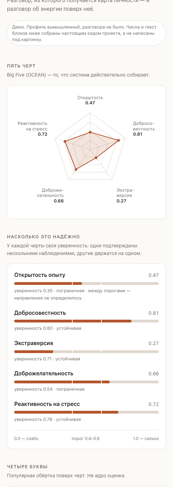

# Neuro

Telegram-бот, который в живом разговоре собирает карту личности по **Big Five (OCEAN)**
и превращает её в разговор об энергии: на что опираться, что разгружать, где копится
риск выгорания.

Не тест с вариантами ответов. Человек рассказывает про вчерашний сорванный релиз —
бот замечает в этом наблюдения и складывает их, пока картина не станет выразимой.

```
— Обычно планирую день с вечера, иначе к обеду начинаю нервничать.
— Какой именно момент в плане помогает тебе чувствовать себя спокойнее?
```

**→ [Посмотреть, как выглядит результат](https://ellavsen.github.io/Big_Five/)** — витрина на примерном
профиле. Профиль вымышленный, но числа и текст блоков там собраны настоящим кодом проекта.

Та же страница — это и Telegram Mini App: открытая внутри Telegram, она тянет профиль
человека через API, открытая в браузере — показывает демо. Второй копии нет, поэтому
им нечем разойтись.



Скриншот снят с работающей страницы, а не нарисован: числа на нём посчитаны
теми же модулями, что считают настоящий профиль.

---

## Что здесь интересного

**Big Five — ядро, MBTI — вывеска.** Четыре буквы считаются из черт и показываются
только с оговоркой. У Neuroticism пары в MBTI нет — а это ровно та черта, которая
отвечает за истощение и восстановление, то есть за смысл продукта. Пока модель была
четырёхосевой MBTI, наблюдения про энергию класть было некуда.

**Итог не выдаётся сам.** Система решает, что карта стала выразимой, и **спрашивает**.
Без явного «да» синтеза не будет. Это не UX-деталь, а принцип: человеку не сообщают,
кто он, пока он не попросил.

**Детерминированный слой отдельно от LLM.** Модули на правилах ловят маркеры энергии,
компенсаций и роли в команде — интерпретируемо и дёшево. LLM отвечает за разговор
и за связный текст, но не за арифметику: черта закрывается накоплением веса, а не
одним ярким словом.

**Профиль растёт во времени.** Новый разговор начинается не с чистого листа: черты
прошлого итога подтягиваются в промпт, и задача синтеза — показать, **что изменилось**.

---

## Чем это не является

Проще сказать сразу, чем оставить на догадки.

- **Это не измерение.** Big Five как модель обоснована научно, но измеряют её
  валидированными опросниками с нормами на выборке. Здесь языковая модель читает
  разговор. Другой жанр.
- **Результат нестабилен.** Один и тот же вход в замерах давал разные значения по
  спорным чертам. Тот же человек в другой день получит другой профиль.
- **Это не диагностика и не медицинская помощь.** Формулировки намеренно вероятностные.
- **Оно отражает то, что вы сами сказали.** Ощущение «надо же, точно про меня» стоит
  относить скорее к этому, чем к точности метода.

Ценность — в вопросах и в разговоре про энергию, а не в цифрах.

---

## Архитектура

```
app/telegram_bot.py     Telegram I/O, согласие, горячий кэш диалогов
  └─ core/orchestrator  один планировщик хода: модули → валидность → черты → LLM
       ├─ core/llm      OpenAI, structured outputs, таймауты и ретраи
       ├─ core/validity закрытие черт по накоплению веса, критерий готовности
       ├─ core/scoring  MBTI как производная от черт (только для показа)
       ├─ core/matching русский матчинг с учётом отрицаний
       ├─ modules/      детерминированные детекторы: энергия, компенсации, роль в команде
       └─ core/db/      SQLAlchemy async → PostgreSQL
prompts/                turn_planner.md и synthesizer.md
migrations/             нумерованные .sql, применяются вручную
```

Агентов нет. `chosen_agent` — это режим одного планировщика, исторически названный
«агентом»; отдельных моделей и промптов за ним не стоит.

**Стек:** Python 3.12, python-telegram-bot 20.7, OpenAI SDK (structured outputs),
Pydantic 2, SQLAlchemy 2 (async), PostgreSQL 16.

---

## Приватность

Психологический профиль — специальная категория персональных данных, и обращение
с ним встроено в код, а не описано в намерениях.

- **До согласия не собирается ничего**: ни сессии, ни сообщений, ни вызовов LLM.
  Единственное, что известно до «да», — Telegram ID, иначе согласие не к чему привязать.
- Текст согласия версионируется: меняется текст — согласие спрашивается заново.
- `/delete_me` удаляет всё каскадом и работает **даже без согласия** — иначе отозвавший
  согласие не смог бы стереть уже собранное.
- Ретеншен 180 дней.
- Рабочий снимок профиля затирается сразу, как разговор завершён.

Текст согласия не проходил юридическую экспертизу — до живых пользователей его нужно
показать юристу.

---

## Как запустить

Нужны Python 3.12 (3.13 несовместим с `python-telegram-bot==20.7`) и PostgreSQL 16.

```bash
brew install postgresql@16 && brew services start postgresql@16
createdb neuro_db

python3.12 -m venv venv && source venv/bin/activate
pip install -r requirements.txt

cp .env.example .env    # заполнить ключи
python -m app.main      # схему развернёт init_db() при старте
```

Чтобы работала ещё и карта (Mini App), нужны веб-сервис и HTTPS-туннель — Telegram
открывает Mini App только по `https`. Всё вместе поднимается одной командой:

```bash
brew install cloudflared
./run.sh
```

Скрипт стартует веб-сервис, туннель и бота, а свежий адрес туннеля сам вписывает
в `.env`: бесплатный туннель выдаёт новый адрес при каждом запуске, и вписывать его
руками — верный способ однажды получить кнопку, ведущую в никуда.

Подробная инструкция со всеми граблями — [docs/RUNNING.md](docs/RUNNING.md).

Файлы в `migrations/` нужны **только для обновления уже существующей базы**.
На чистой их запускать не надо и нельзя: `002` переименовывает колонку, которой
на новой схеме просто нет.

Проверка:

```bash
pytest -q                            # 115 тестов
ruff check app core modules tests
```

---

## Как это делалось

[docs/ROADMAP.md](docs/ROADMAP.md) — план по этапам и разбор того, что ломалось.
Там же замеры «до/после» и вещи, которые я решил **не** чинить, с причинами.

Несколько находок оттуда, чтобы было понятно, зачем туда заглядывать:

- ось EI была инвертирована относительно трёх остальных — интроверт получал
  рекомендации для экстраверта. Пряталось за тем, что значения жались ровно к порогу;
- миграция переименовала колонку и не изменила её тип, а слой доступа глушил любое
  исключение — наблюдения молча не сохранялись: 21 сообщение в базе и ноль наблюдений;
- «мягкое» условие закрытия черты оказалось строже «жёсткого», и связывающим было
  именно оно;
- экран согласия не отправлялся из-за непарного подчёркивания в `/delete_me`:
  Telegram отклоняет такое сообщение целиком.

Каждое из этого нашлось живым прогоном, а не тестами.

---

## Статус

Ранний MVP. Работает локально, публичного деплоя пока нет.

Открытые вопросы честно перечислены в [docs/ROADMAP.md](docs/ROADMAP.md) и
[CLAUDE.md](CLAUDE.md).
